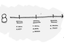

# DIU24
Prácticas Diseño Interfaces de Usuario 2023-24 (Tema: Talleres Gastronómicos ) 

Grupo: DIU2_fanculos.  Curso: 2023/24 
Updated: 20/5/2024

Proyecto: 
>>> Sabores del mundo

Descripción: 

>>> Sabores del Mundo será una empresa que irrumpa con fuerza en el sector. Nos aseguraremos de que los clientes vivan una experiencia que sea digna de ser contada. En Sabores del Mundo ofertamos una serie de cursos adaptados a todos los niveles y de los lugares más variopintos del planeta, que no sólo se reduce a enseñar a cocinar sino también tendrá una ambientación digna de ese país.

Logotipo: 
>>> 

Miembros
 * :bust_in_silhouette:   Rubén Mondéjar González     :octocat:     
 * :bust_in_silhouette:  José Manuel Casanova Martínez     :octocat:

----- 

# Proceso de Diseño 

## Paso 1. UX User & Desk Research & Analisis 

 **1.a User Reseach Plan**
-----

>>> El user research consiste en una investigación sobre el sector de turismo culinario. Hemos visto los posibles objetivos, resultados y usuarios de un servicio que es muy amplio y variado.
>>> Principalmente está destinado para usuarios que les guste la cocina, profesionales del sector o gente que lo que busque sean actividades de ocio.

 1.b Competitive Analysis
-----

>>> Este análisis se basa en una comparación de calidad de las distintas páginas elegidas, en este caso:
>>> - Granada Cooking https://granadacooking.com/
>>> - Kitchen Club https://www.kitchenclub.es/es/
>>> - Cuina Canela Fina https://cuinacanelafina.com/
>>>
>>> Hemos elegido como página principal a comparar la página de Granada Cooking, por desarrollarse en nuestra ciudad. Para el estudio de competencia, la copararemos con la página de Kitchen Club por ser una de las primeras que aparecen al buscar en Google y Cuina Canela Fina por ser diferente en el sentido de no solo ofrecer cursos online, sino también multiples experiencias de dicho ámbito.
>>> Tras comparar las páginas web de los tres sitios, hemos llegado a la conclusión de que la página de Granada Cooking es mejorable. Tiene cosas buenas como la simplicidad y un menú de navegación, pero por el contrario debería de implementar funcionalidades bastantes útiles que ya tiene su competencia. Estas pueden ser la opción de filtrar los talleres, traducir el contenido a otros lenguajes o incluso añadir fechas o grupos más grandes.
>>> Como conclusión, la ganadora del análisis de competencia ha sido la de Cuina Canela, de la cual se pueden coger ideas como el hecho de colaborar con Cocineros Famosos y no tanto con empresas o la de crear talleres en distintas modalidades.

 1.c Persona
-----

>>> Llegados a este punto hemos creado dos personas ficticias para usarlas como sujetos que van a participar en el turismo gatronómico.
>>> #### [Primera persona, Carla Perez](P1/persona_carla.pdf)
>>> Carla es una choni que nunca ha querido estudiar y siempre le ha gustado más el mundo nocturno y la vida social. Hemos creado a esta persona para tener un enfoque más alocado y de una persona que no ha realizado nunca este tipo de actividades.

>>> #### [Segunda persona, Daniel Ochoa](P1/persona_daniel.pdf)
>>> Daniel  es un profesor de tecnología, un apasionado de su profesión. Pretende transmitir todos sus conocimientos y experiencias a sus alumnos.
>>> Junto a su Seat Panda que le regaló su padre le gusta recorrer España en busca de nuevos retos de los que aprenderá algo. También aprovecha para visitar a menudo a sus familiares, que se encuentran dispersos por toda España.
>>> Es una persona algo solitaria, pero le gusta conocer gente siempre que puede.
>>>
>>> Hemos elegido a esta persona para cubrir el enfoque de un grupo mayoritario que demanda este tipo de actividades, es decir, personas que buscan actividades de ocio. También, el hecho de que sea una persona algo mayor nos sirve para estudiar mejor la interacción con la interfaz. 

 1.d User Journey Map
----

>>> Después de presentar a nuestras personas vamos a crear una hoja de ruta sobre la experiencia que han tenido con nuestra página web elegida, Granada Cooking.
>>> #### [Journey Map de Carla Perez](journey_map_carla.pdf)
>>> #### [Journey Map de Daniel Ochoa](journey_map_daniel.pdf)
>>> Como se podía esperar, cada persona ha experimentado diferentes reacciones al usar la misma página web. Han tenido algún problema diferente como a la hora de seleccionar el curso, ya que cada uno tiene gustos y preferencias distintas, sin embargo también han experimentado el mismo a la hora de ver la disponibilidad de los cursos. Podríamos sacar como conclusión que hay tanto algunos aspectos díficiles de abordar en los que cada persona tiene un punto de vista distinto, como otros en los que la opinión es más generalizada.

 1.e Usability Review
----
>>> [Documento valoración](P1/Usability-review.pdf)
>>> 
>>> La página ha obtenido como calificación numérica final un total de 81/100
>>> 
>>> En este proyecto hemos realizado un estudio extenso sobre el turismo gastronómico y en particular sobre las páginas web de las empresas que ofrecen estos servicios.
>>> Cabe destacar que todo lo hemos realizado con unas plantillas que se nos ofrecieron para poder mostrar toda la información en múltiples aspectos.
>>> Cada persona es distinta y al crear dos ficticias y usarlas como usuarios de la Página Web nos ha ayudado a poder ponernos en un punto de vista externo y diferente al nuestro para poder hacernos una idea de las distintas fallas y problemas que podrían encontrar.
>>> En definitiva, podríamos afirmar que esta práctica nos ha ayudado a familiarizarnos con las interfaces y poder entender como potenciarlas.

## Paso 2. UX Design  

 2.a Reframing / IDEACION: Feedback Capture Grid / EMpathy map 
----

>>> Hemos decidido realizar un [mapa de empatía](P2/EmpathyMap.pdf) en el que tenemos en cuenta que perspectivas podrían tener los usuarios al relacionarse con el mundo de los talleres gastronómicos.

 2.b ScopeCanvas
----
>>> Sabores del Mundo será una empresa que irrumpa con fuerza en el sector. Nos aseguraremos de que los clientes vivan una experiencia que sea digna de ser contada.
>>> En Sabores del Mundo ofertamos una serie de cursos adaptados a todos los niveles y de los lugares más variopintos del planeta, que no sólo se reduce a enseñar a cocinar sino
también tendrá una ambientación digna de ese país.
>>> Ofrecemos:
>>> - Una subscripcción mensual al club Saborín que te de acceso a un taller exclusivo del club junto a descuentos en el resto de talleres y tutorias personales con nuestros chefs.
>>> - Amplio abanico de talleres de todas las partes del mundo, con un chef especializado en el mismo.
>>> - Talleres totalmente ambientados con la temática local de los platos a realizar.
>>> - Clasificación de los talleres según las habilidades de los usuarios.
>>> - Eventos privados destinados para empresas.
>>> - Platos saludables de los que mostramos los valores nutricionales.
>>> - Acceso a una extensa comunidad de usuarios que compartan su interes por la cocina.
>>> - Un sistema de valoraciones.

 2.b User Flow (task) analysis 
-----

>>> Hemos realizado un [analisis de todas](P2/analisis_de_tareas.pdf) las tareas que se podrán realizar en nuestra página web, realizando una división por tipos de usuarios: Clientes, Administrador o Empleados; y cadencia de uso de cada tarea: Nula, Baja, Media o Alta. Las tres tareas que más se realizan son "Crear una cuenta", "Iniciar sesión" y "Comentar en la comunidad".
>>> A estas tres tareas más repetidas les hemos realizado un [user flow](P2/User_Flow_Kit.pdf) que muestra el flujo de las acciones que se pueden realizar en cada página.

 2.c IA: Sitemap + Labelling 
----

>>> El [sitemap](P2/Sitemap.png) consiste en un esquema de como se puede recorrer nuestra página web al completo, además tenemos el [etiquetado](Etiquetado.pdf) que nos incluye información sobre cada uno de las páginas a las que podemos acceder.

 2.d Wireframes
-----

>>> Primero se debía dibujar un boceto sobre cada página a la que podemos tener acceso: [lista de bocetos](P2/bocetos.pdf).
>>> Después hemos pasado esos diseños a figma: [bocetos figma](P2/Diseños_figma.pdf); y finalmente se tenía que elegir una de ellas para adaptarla a un diseño responsive, en nuestro caso se ha elegido la página del taller seleccionado, aquí tenemos como ha quedado el diseño: [diseño](P2/Diseño_responsive.fig).

## Paso 3. Mi UX-Case Study (diseño)

 3.a Moodboard
-----

>>> [diseño](p3/ALL-Moodboard.pdf)
>>> El nombre de sabores del mundo pretende transmitir nuestro objetivo como empresa, que no es otro que el de traer la comida extrangera a nuestras cocinas.
>>> - Nuestro logo es sencillo y denota elegancia.
>>> - Nuestra gama de colores presentan tonos pastelosos y cumplen con los tests de contraste, tanto AA como AAA.
>>> - Hemos elegido unas tipografías sencillas y elegantes como el logo, siendo estas "Daniel" e "Inria Sans".
>>> - Hemos empleado un conjunto de iconos ampliamente estandárizados.

  3.b Landing Page
----

>>> Nuestra [Landing Page](p3/LadingPage.pdf) trata de atrear al público mediante unas imágenes impactantes. De igual forma exponemos el eslogan de nuestra empresa junto a tres razones por la que un usuario debería confiar en nosotros.

 3.c Guidelines
----

>>> Los patrones que hemos decidido usar para la creación del prototipo son:
>>> - Onboarding: Creación de pantalla de bienvenida.
>>> - Menu: Lista de apartados de navegación disponibles.
>>> - Carousel: Sección destacada de imágenes.
>>> - Search: Barra de busqueda.
>>> - Article list: Una lista de artículos con tarjetas.
>>> - Reserva: Una pantalla para reservar taller, con un calendario.
>>> - Formulario de entrada de datos: Formulario para capturar la información de usuarios.
>>> - Acerca de: Mostramos la información de la empresa.
>>> - Wizard: Hemos creado una secuencia de pasos.
>>> 
>>>   1º Reservar taller:
>>>    - Abrimos la pestaña de talleres.
>>>    - Navegamos hasta encontrar el que deseemos.
>>>    - Clicamos en el taller que queremos realizar.
>>>    - Una vez dentro elegimos la fecha y reservamos.
>>>     
>>>   2º Subscribirse al club:
>>>    - Seleccionamos el incono del club.
>>>    - Navegamos por el menu desplegable hasta llegar a la opción "Subscríbete".
>>>    - Una vez dentro seleccionamos el tipo de subscripción que queremos, añadiendola al carrito.
>>>     
>>>   3º Pagar:
>>>    - Abrimos el carrito: Seleccionamos el icono del carrito para ver todo lo que tenemos ya en él. Aquí se mostrará el importe total a pagar.
>>>    - Elegimos método de pago: Elegimos entre tarjeta y paypal.
>>>    - Introducimos datos de la tarjeta y pinchamos en "Usar esta tarjeta".
>>>    - Se te mostrará un resumen de la compra y confirmaremos el pago clicando en la opción "Pagar".

  3.d Mockup
----

>>> https://www.figma.com/design/N3kjIR6WIFIBuNoY6UtC3U/guidelines?node-id=0%3A1&t=2Cn85bQoROY27zsZ-1
>>> En este enlace tenemos los diseños realizados. Seleccionando el botón Play que sale en la esquina superior izquierda de figma nos mandará a otra pestaña y a partir de ella podremos interactuar con la aplicación clicando en los distintos botones.

## Paso 5. Exportación & evaluación con Eye Tracking 

Exportación a HTML/Flutter
-----

)  5.b Eye Tracking method 

>>> Indica cómo diseñas experimento y reclutas usuarios (uso de gazerecorder.com)  

Diseño del experimento 
----

>> Uso de imágenes (preferentemente) -> hay que esablecer una duración de visualización y  
>> fijar las áreas de interes (AoI) antes del diseño. Planificar qué tarea debe hacer el usuario (buscar, comprar...) 

  
>> cambiar img por tu diseño de experimento  

>> Recordar que gazerecorder es una versión de pruebas: usar sólo con 3 usuarios para generar mapa de calor (recordar que crédito > 0 para que funcione) 

Resultados y valoración 
-----

>> Cambiar por tus resultados
  

## Paso 4. Evaluación 

 4.a Caso asignado
----

>>> Breve descripción del caso asignado con enlace a  su repositorio Github

 4.b User Testing
----

>>> Seleccione 4 personas ficticias. Exprese las ideas de posibles situaciones conflictivas de esa persona en las propuestas evaluadas. Asigne dos a Caso A y 2 al caso B
 

| Usuarios | Sexo/Edad     | Ocupación   |  Exp.TIC    | Personalidad | Plataforma | TestA/B
| ------------- | -------- | ----------- | ----------- | -----------  | ---------- | ----
| Pedro  | H / 59   | Profesor  | Intermedio       | Sorprendido | Windows       | A 
| Rosa  | M / 27   | Peluquera  | Bajo       | Feliz       | Móvil        | A 
| Juan  | H / 70   | Jubilado     | Baja        | Tristeza    | Windows      | B 
| Laura  | M / 18   | Estudiante  | Avanzado       | Enfado     | Móvil        | B 

 4.c Cuestionario SUS
----

>>> Usaremos el **Cuestionario SUS** para valorar la satisfacción de cada usuario con el diseño (A/B) realizado. Para ello usamos la [hoja de cálculo](https://github.com/mgea/DIU19/blob/master/Cuestionario%20SUS%20DIU.xlsx) para calcular resultados sigiendo las pautas para usar la escala SUS e interpretar los resultados
http://usabilitygeek.com/how-to-use-the-system-usability-scale-sus-to-evaluate-the-usability-of-your-website/)
Para más información, consultar aquí sobre la [metodología SUS](https://cui.unige.ch/isi/icle-wiki/_media/ipm:test-suschapt.pdf)

>>> Adjuntar captura de imagen con los resultados + Valoración personal 

 4.d Usability Report
----

>> Añadir report de usabilidad para práctica B (la de los compañeros)

>>> Valoración personal 

5.) Conclusion de EVALUACION (A/B testing + usability report + eye tracking) 
----

>> recupera el usability report de tu práctica (que es el caso B de los asignados a otros grupos) 
>> con los resultados del A/B testing, de eye tracking y del usability report:
>>  comentad en 2-3 parrafos cual es la conclusion acerca de la realización de la práctica y su evaluación con esas técnicas y que habéis aprendido

## Conclusión final / Valoración de las prácticas

>>> (90-150 palabras) Opinión FINAL del proceso de desarrollo de diseño siguiendo metodología UX y valoración (positiva /negativa) de los resultados obtenidos  

